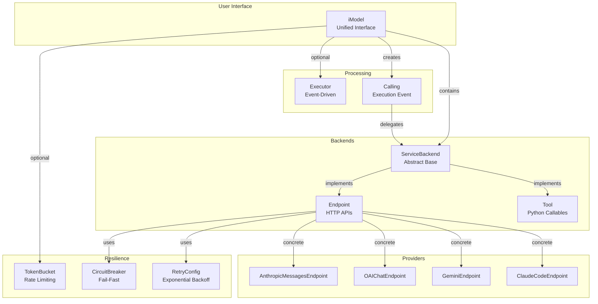

# services Module

> Unified service interface for LLM APIs, tools, and third-party integrations

## Overview

The `services` module provides a comprehensive framework for interacting with language models, APIs, and tools through a unified interface. It abstracts away provider-specific details while offering production-ready features like rate limiting, circuit breaking, retry logic, and hook-based lifecycle management.

**Core Architecture:**

- **`iModel`**: Universal service interface wrapping any backend (LLM, API, tool)
- **Backends**: `Endpoint` (HTTP APIs), `Tool` (Python callables), extensible protocol
- **ServiceRegistry**: Name-indexed service discovery and management
- **Resilience**: Circuit breakers, exponential backoff retry, rate limiting
- **Hooks**: Pre/post invocation lifecycle hooks for logging, metrics, transforms

**Key Features:**

- **Provider Auto-Matching**: `iModel(provider="anthropic")` auto-configures endpoints
- **Rate Limiting**: Token bucket algorithm with request and token limits
- **Event-Driven Processing**: Executor-based processing with automatic rate limiting
- **Streaming**: Built-in streaming support with channel abstraction
- **Serialization**: Full serialization for persistence (Endpoint backends only)
- **Type Safety**: Pydantic-based request validation and response normalization

**When to Use This Module:**

- Building LLM-powered applications with multiple providers
- Rate-limited API consumption with automatic backoff
- Tool-based agent systems with schema validation
- Production deployments requiring resilience patterns
- Multi-model orchestration with unified interface

## Module Exports

```python
from lionpride.services import (
    # Core types
    iModel,
    ServiceRegistry,

    # Backends (abstract)
    ServiceBackend,
    Endpoint,
    Tool,

    # Configuration
    EndpointConfig,

    # Event types
    Calling,
)
```

## Architecture Diagram



## Quick Start

### Basic Usage (Auto-Matching)

```python
from lionpride.services import iModel

# Auto-match provider to endpoint
model = iModel(provider="anthropic", api_key="ANTHROPIC_API_KEY")

# Single call
calling = await model.invoke(
    model="claude-sonnet-4-5",
    messages=[{"role": "user", "content": "Hello!"}]
)
print(calling.response.data)  # Extracted text response
```

### With Rate Limiting

```python
from lionpride.services import iModel

# Auto-construct executor with rate limits (lionagi v0 pattern)
model = iModel(
    provider="openai",
    api_key="OPENAI_API_KEY",
    limit_requests=50,      # 50 requests per minute
    limit_tokens=100000,    # 100k tokens per minute
    capacity_refresh_time=60.0,
)

# Calls are automatically rate-limited
calling = await model.invoke(
    model="gpt-4o-mini",
    messages=[{"role": "user", "content": "Hello!"}]
)
```

### With Circuit Breaker and Retry

```python
from lionpride.services import iModel
from lionpride.services.utilities.resilience import CircuitBreaker, RetryConfig
from lionpride.services.providers.anthropic_messages import AnthropicMessagesEndpoint

# Create backend with resilience patterns
backend = AnthropicMessagesEndpoint(
    api_key="ANTHROPIC_API_KEY",
    circuit_breaker=CircuitBreaker(
        failure_threshold=5,
        recovery_time=30.0,
    ),
    retry_config=RetryConfig(
        max_retries=3,
        initial_delay=1.0,
        exponential_base=2.0,
    ),
)

model = iModel(backend=backend)
```

### Streaming

```python
from lionpride.services import iModel

model = iModel(provider="openai", api_key="OPENAI_API_KEY")

# Stream chunks
async for chunk in model.invoke_stream(
    model="gpt-4o-mini",
    messages=[{"role": "user", "content": "Write a story"}]
):
    print(chunk, end="", flush=True)

# Stream with channel (fan-out)
channel = await model.invoke_stream_with_channel(
    model="gpt-4o-mini",
    messages=[{"role": "user", "content": "Write a story"}]
)
channel.add_consumer(lambda chunk: print(chunk.content))
async for chunk in channel:
    pass
full_text = channel.get_accumulated()
```

### Service Registry

```python
from lionpride.services import iModel, ServiceRegistry

registry = ServiceRegistry()

# Register multiple models
registry.register(iModel(provider="anthropic", api_key="..."))
registry.register(iModel(provider="openai", api_key="..."))

# Lookup by name
model = registry.get("anthropic_messages")
calling = await model.invoke(...)

# List by tag
backends = registry.list_by_tag("llm")
```

## Module Structure

| Component | Purpose | Documentation |
|-----------|---------|---------------|
| **Core** | | |
| [`iModel`](imodel.md) | Unified service interface | Main entry point |
| [`ServiceRegistry`](registry.md) | Service discovery and management | Name-indexed storage |
| **Backends** | | |
| [`Endpoint`](providers.md#endpoint) | HTTP API backend | OpenAI, Anthropic, etc. |
| [`Tool`](providers.md#tool) | Python callable backend | Schema-validated tools |
| **Providers** | | |
| [`AnthropicMessagesEndpoint`](providers.md#anthropicmessagesendpoint) | Anthropic Messages API | Claude models |
| [`OAIChatEndpoint`](providers.md#oaichatendpoint) | OpenAI Chat Completions | OpenAI, Groq, etc. |
| [`GeminiEndpoint`](providers.md#geminiendpoint) | Google Gemini API | Gemini models |
| [`ClaudeCodeEndpoint`](providers.md#claudecodeendpoint) | Claude Code CLI | Local CLI access |
| **Resilience** | | |
| [`TokenBucket`](rate_limiting.md#tokenbucket) | Rate limiting | Token bucket algorithm |
| [`CircuitBreaker`](resilience.md#circuitbreaker) | Fail-fast pattern | Prevent cascading failures |
| [`RetryConfig`](resilience.md#retryconfig) | Retry with backoff | Exponential backoff |

## Common Patterns

### Pattern 1: Multi-Provider Setup

```python
from lionpride.services import iModel, ServiceRegistry

registry = ServiceRegistry()

# Register multiple providers
for provider in ["anthropic", "openai", "groq"]:
    model = iModel(
        provider=provider,
        api_key=f"{provider.upper()}_API_KEY",
        limit_requests=50,
        limit_tokens=100000,
    )
    registry.register(model)

# Use based on requirements
fast_model = registry.get("groq_chat")  # For speed
smart_model = registry.get("anthropic_messages")  # For reasoning
cheap_model = registry.get("openai_chat")  # For cost
```

### Pattern 2: Tool Integration

```python
from lionpride.services import iModel, Tool, ServiceRegistry
from pydantic import BaseModel, Field

# Define tool schema with Pydantic
class WeatherRequest(BaseModel):
    location: str = Field(..., description="City name")
    units: str = Field("celsius", description="Temperature units")

def get_weather(location: str, units: str = "celsius") -> dict:
    """Get weather for a location."""
    return {"temp": 22, "conditions": "sunny", "location": location}

# Create tool backend
tool = Tool(
    func_callable=get_weather,
    config={"request_options": WeatherRequest}
)

# Wrap in iModel and register
tool_model = iModel(backend=tool)
registry = ServiceRegistry()
registry.register(tool_model)

# Execute
calling = await registry.get("get_weather").invoke(
    location="San Francisco"
)
print(calling.response.data)  # {"temp": 22, ...}
```

### Pattern 3: Serialization and Persistence

```python
from lionpride.services import iModel

# Create model with endpoint backend
model = iModel(
    provider="anthropic",
    api_key="ANTHROPIC_API_KEY",
    limit_requests=50,
    limit_tokens=100000,
)

# Serialize to dict (excludes runtime state)
config = model.to_dict()

# Store in database or file
import json
with open("model_config.json", "w") as f:
    json.dump(config, f)

# Restore from dict (fresh capacity)
restored = iModel.from_dict(config)

# API key must still be in environment
calling = await restored.invoke(...)
```

### Pattern 4: Hook-Based Observability

```python
from lionpride.services import iModel
from lionpride.services.types.hook import HookRegistry, HookPhase

# Define hooks
async def log_request(event, **kwargs):
    print(f"Request: {event.payload}")

async def log_response(event, **kwargs):
    print(f"Response: {event.execution.response}")

# Create hook registry
hooks = HookRegistry()
hooks.register(HookPhase.PreInvocation, log_request)
hooks.register(HookPhase.PostInvocation, log_response)

# Attach to model
model = iModel(
    provider="openai",
    api_key="OPENAI_API_KEY",
    hook_registry=hooks,
)

# Hooks execute automatically
calling = await model.invoke(...)
```

## Design Rationale

### Why iModel?

The `iModel` class unifies diverse backends (LLM APIs, tools, custom services) behind a single interface. This enables:

1. **Polymorphic Service Access**: Treat all services uniformly regardless of backend
2. **Hot-Swapping**: Switch providers without code changes (same interface)
3. **Composability**: Build higher-level abstractions (agents, workflows) on top
4. **Testing**: Mock any service by swapping backends

### Why ServiceBackend Protocol?

The abstract `ServiceBackend` protocol enables extensibility without inheritance coupling:

- **Endpoint**: HTTP-based services (OpenAI, Anthropic, custom APIs)
- **Tool**: Python callables (functions, methods, lambdas)
- **Custom**: Implement protocol for any service type (databases, message queues, etc.)

### Why Executor-Based Processing?

Executor pattern (from lionagi v0) enables:

- **Automatic Rate Limiting**: Executor manages token bucket capacity
- **Queue Management**: Batch processing with capacity-aware queuing
- **Observability**: Centralized metrics and monitoring
- **Backpressure**: Graceful degradation under load

### Why Separate Calling from Backend?

`Calling` (Event) separates **what to execute** from **how to execute**:

- **Lifecycle Hooks**: Pre/post invocation hooks without backend changes
- **Retry Logic**: Retry at event level, not backend level
- **Cancellation**: Cancel individual calls without affecting backend
- **Metrics**: Track per-call latency, cost, tokens

## Common Pitfalls

### Pitfall 1: Tool Serialization

```python
# ❌ WRONG: Tool backends cannot serialize
tool = Tool(func_callable=my_function)
model = iModel(backend=tool)
config = model.to_dict()  # Raises NotImplementedError

# ✅ CORRECT: Use Endpoint backends for persistence
endpoint = AnthropicMessagesEndpoint(api_key="...")
model = iModel(backend=endpoint)
config = model.to_dict()  # Works
```

### Pitfall 2: Missing API Key After Deserialization

```python
# ❌ WRONG: API key env var changed
model = iModel(provider="anthropic", api_key="OLD_ENV_VAR")
config = model.to_dict()
# ... later, env var renamed to NEW_ENV_VAR
restored = iModel.from_dict(config)  # ValueError: env var not found

# ✅ CORRECT: Ensure env var consistency or use SecretStr
from pydantic import SecretStr
model = iModel(
    provider="anthropic",
    api_key=SecretStr("raw_credential")  # Cleared on serialization
)
```

### Pitfall 3: Rate Limit Timeout on Slow Calls

```python
# ❌ WRONG: Default poll timeout too short for slow models
model = iModel(
    provider="anthropic",
    limit_requests=10,
)
calling = await model.invoke(...)  # TimeoutError after 10s

# ✅ CORRECT: Increase poll_timeout for slow models
calling = await model.invoke(
    poll_timeout=120.0,  # 2 minutes for large models
    ...
)
```

### Pitfall 4: Executor State Not Preserved

```python
# ❌ WRONG: Assuming depleted capacity is serialized
model = iModel(provider="openai", limit_requests=50)
# ... use 40 requests
config = model.to_dict()
restored = iModel.from_dict(config)
# Restored model has FULL capacity (50 requests), not 10

# ✅ CORRECT: Understand serialization resets capacity
# If you need persistent capacity tracking, implement custom solution
```

## Performance Considerations

### Executor Polling Overhead

From `iModel.invoke()` implementation (BLIND-4):

- **Fast backends (<100ms)**: Polling adds 100-200% overhead (not recommended)
- **Slow backends (>1s)**: Polling adds <10% overhead (acceptable)
- **Recommendation**: Use executor for rate-limited batch processing, not single fast calls

### Request Validation Overhead

Pydantic validation adds ~1-5ms per request. To minimize:

```python
# Create calling once, reuse with different timeouts
calling = await model.create_calling(model="gpt-4o-mini", messages=[...])
calling.timeout = 120.0
calling = await model.invoke(calling=calling)  # Skips create_calling
```

### Streaming vs Batch

Streaming bypasses executor path for direct consumption:

```python
# Streaming: No executor overhead, immediate chunks
async for chunk in model.invoke_stream(...):
    process(chunk)

# Batch: Executor overhead, full response
calling = await model.invoke(...)
process(calling.response.data)
```

## See Also

- **Core Components**:
  - [`iModel`](imodel.md): Main service interface
  - [`ServiceRegistry`](registry.md): Service management
- **Providers**:
  - [`Providers Overview`](providers.md): All provider endpoints
- **Resilience**:
  - [`Rate Limiting`](rate_limiting.md): TokenBucket implementation
  - [`Resilience Patterns`](resilience.md): Circuit breaker and retry
- **Related Modules**:
  - [Event](../base/event.md): Base event system
  - [Executor](../base/executor.md): Event-driven processing
  - [Element](../base/element.md): UUID-based identity
