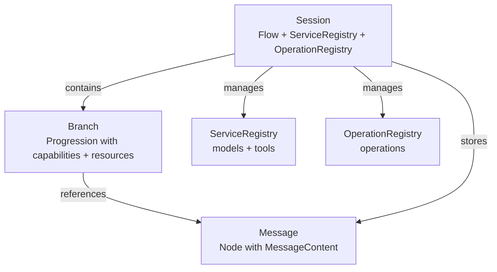

# session Module

> Conversation management with multi-branch support, structured messages, and service integration

## Overview

The `session` module provides high-level abstractions for managing conversational workflows with language models. It implements a **Session → Branch → Message** hierarchy that enables multi-branch conversations, structured message handling, and resource access control.

**Key Capabilities:**

- **Multi-Branch Conversations**: Manage multiple conversation threads within a single session
- **Structured Messages**: Type-safe message content with automatic role derivation
- **Service Integration**: Unified registry for models, tools, and operations
- **Access Control**: Branch-level resource and capability restrictions
- **Message Preparation**: Intelligent context organization for chat APIs
- **Operation Execution**: Integrated workflow execution with IPU pattern

**When to Use This Module:**

- Building conversational agents with branching logic (A/B testing, rollback scenarios)
- Managing complex multi-turn interactions with structured outputs
- Implementing access control for different conversation contexts
- Coordinating multiple models/tools within a single session
- Preparing messages for chat APIs with context consolidation

## Module Exports

```python
from lionpride.session import (
    # Core session management
    Session,
    Branch,

    # Message handling
    Message,
    MessageContent,
    MessageRole,
    SenderRecipient,

    # Content types
    SystemContent,
    InstructionContent,
    AssistantResponseContent,
    ActionRequestContent,
    ActionResponseContent,

    # Utilities
    prepare_messages_for_chat,
)
```

## Architecture Overview

### Session → Branch → Message Hierarchy



**Key Relationships:**

1. **Session** contains **Flow[Message, Branch]**
   - Messages stored once in `session.messages` (Pile[Message])
   - Branches reference messages via UUID (Pile[Branch])
   - O(1) message lookup, efficient sharing across branches

2. **Branch** extends **Progression**
   - Ordered list of message UUIDs
   - System message reference (first position)
   - Capabilities (structured output schemas)
   - Resources (allowed services)

3. **Message** extends **Node**
   - Content: MessageContent discriminated union
   - Auto-derived role from content type
   - Sender/recipient tracking

### Message Content Discriminated Union

```python
MessageContent (base)
├── SystemContent        → MessageRole.SYSTEM
├── InstructionContent   → MessageRole.USER
├── AssistantResponseContent → MessageRole.ASSISTANT
├── ActionRequestContent → MessageRole.ASSISTANT
└── ActionResponseContent → MessageRole.TOOL
```

**Auto-Role Derivation**: Each content type has a `ClassVar[MessageRole]` that automatically determines the message role without manual assignment.

## Quick Reference

| Class/Function | Purpose |
|----------------|---------|
| [`Session`](session.md) | Top-level conversation manager with service/operation registries |
| [`Branch`](branch.md) | Conversation thread with access control (extends Progression) |
| [`Message`](message.md) | Universal message container with auto-derived role (extends Node) |
| [`MessageContent`](message_content.md#messagecontent) | Base for content variants (discriminated union) |
| [`SystemContent`](message_content.md#systemcontent) | System instructions with optional timestamp |
| [`InstructionContent`](message_content.md#instructioncontent) | User instructions with structured outputs, tools, images |
| [`AssistantResponseContent`](message_content.md#assistantresponsecontent) | Assistant text responses |
| [`ActionRequestContent`](message_content.md#actionrequestcontent) | Function/tool call requests |
| [`ActionResponseContent`](message_content.md#actionresponsecontent) | Function/tool call results |
| [`MessageRole`](message.md#messagerole) | Enum for message roles (SYSTEM, USER, ASSISTANT, TOOL, UNSET) |
| [`SenderRecipient`](message.md#senderrecipient) | Type alias for sender/recipient (MessageRole \| str \| UUID) |
| [`prepare_messages_for_chat`](message.md#prepare_messages_for_chat) | Prepare messages for chat API with context consolidation |

## Core Workflows

### Creating a Session with Branches

```python
from lionpride.session import Session, Message, InstructionContent, SystemContent

# Create session
session = Session()

# Create branch with system message and access control
system_msg = Message(content=SystemContent(system_message="You are a helpful assistant"))
branch = session.create_branch(
    name="main",
    system=system_msg,
    capabilities={"Analysis", "Report"},  # Allowed structured output schemas
    resources={"gpt4", "search_tool"},    # Allowed service names
)

# Add messages to branch
user_msg = Message(content=InstructionContent(instruction="Analyze this data"))
session.add_message(user_msg, branches=branch)

# Access messages via session.messages or branch
messages = [session.messages[uid] for uid in branch]
```

### Multi-Branch Workflow

```python
from lionpride.session import Session, Message, InstructionContent

session = Session()
main_branch = session.create_branch(name="main")

# Add messages to main branch
msg1 = Message(content=InstructionContent(instruction="Hello"))
msg2 = Message(content=InstructionContent(instruction="Analyze X"))
session.add_message(msg1, branches=main_branch)
session.add_message(msg2, branches=main_branch)

# Fork at decision point (preserves message history)
experimental_branch = session.fork(
    main_branch,
    name="experimental",
    capabilities=True,  # Copy capabilities from main
    resources=True,     # Copy resources from main
    system=True,        # Copy system message from main
)

# Add different messages to each branch
main_msg = Message(content=InstructionContent(instruction="Continue with approach A"))
exp_msg = Message(content=InstructionContent(instruction="Try approach B"))

session.add_message(main_msg, branches=main_branch)
session.add_message(exp_msg, branches=experimental_branch)

# Branches now diverge
print(f"Main: {len(main_branch)} messages")  # 4 (shared + main-specific)
print(f"Experimental: {len(experimental_branch)} messages")  # 4 (shared + exp-specific)
```

### Structured Output with Response Models

```python
from lionpride.session import Session, Message, InstructionContent
from pydantic import BaseModel

class Analysis(BaseModel):
    summary: str
    score: float
    recommendations: list[str]

session = Session()
branch = session.create_branch(name="analysis", capabilities={"Analysis"})

# Instruction with structured output
instruction = Message(
    content=InstructionContent(
        instruction="Analyze the quarterly results",
        context=["Q3 revenue: $1.2M", "Q3 expenses: $800K"],
        response_model=Analysis,
    )
)
session.add_message(instruction, branches=branch)

# Message.rendered includes TypeScript schema and JSON format instructions
print(instruction.rendered)
# Output:
# Instruction: Analyze the quarterly results
# Context:
#   - Q3 revenue: $1.2M
#   - Q3 expenses: $800K
#
# Output Types:
#   interface Analysis {
#     summary: string;
#     score: number;
#     recommendations: string[];
#   }
#
# ResponseFormat:
#   **MUST RETURN VALID JSON. USER's SUCCESS DEPENDS ON IT.**
#   Example structure:
#   ```json
#   {"summary": "...", "score": 0, "recommendations": ["..."]}
#   ```
```

### Service Integration and Execution

```python
from lionpride.session import Session, Branch
from lionpride.services import ServiceRegistry
from lionpride.operations import OperationRegistry

# Create session with services
session = Session()
session.services.register(my_llm_model)  # iModel instance
session.services.register(search_tool)   # Tool instance

# Create branch with resource access control
branch = session.create_branch(
    name="main",
    resources={"my_llm_model", "search_tool"}  # Only these services allowed
)

# Direct service request (low-level)
response = await session.request("my_llm_model", messages=[...])

# Operation execution (high-level, with access control)
from lionpride.ipu import IPU
ipu = IPU()

# Conduct operation (validates branch.resources and branch.capabilities)
operation = await session.conduct(
    branch=branch,
    operation="generate",
    ipu=ipu,
    imodel="my_llm_model",  # Must be in branch.resources
    messages=[msg1, msg2],
)

# Check operation result
result = await operation.invoke()
```

### Preparing Messages for Chat APIs

```python
from lionpride.session import Session, Message, prepare_messages_for_chat
from lionpride.session import (
    SystemContent, InstructionContent, AssistantResponseContent, ActionResponseContent
)

session = Session()
branch = session.create_branch(name="main")

# Add various message types
session.add_message(Message(content=SystemContent(system_message="You are helpful")), branches=branch)
session.add_message(Message(content=InstructionContent(instruction="Hello")), branches=branch)
session.add_message(Message(content=AssistantResponseContent(assistant_response="Hi there")), branches=branch)
session.add_message(Message(content=ActionResponseContent(result={"data": 42})), branches=branch)
session.add_message(Message(content=InstructionContent(instruction="Analyze the result")), branches=branch)

# Prepare for chat API (intelligent consolidation)
chat_messages = prepare_messages_for_chat(
    messages=session.messages,
    progression=branch,
    to_chat=True,  # Return list[dict] instead of list[MessageContent]
)

# Algorithm:
# 1. Auto-detect system message from first message
# 2. Embed system into first instruction
# 3. Collect ActionResponseContent and embed into following instruction's context
# 4. Merge consecutive AssistantResponses
# 5. Remove tool_schemas and response_model from historical instructions

# Result: Optimized chat messages ready for LLM API
# [
#   {"role": "user", "content": "You are helpful\n\nHello"},
#   {"role": "assistant", "content": "Hi there"},
#   {"role": "user", "content": "Instruction: Analyze the result\nContext:\n  - {\"data\": 42}"}
# ]
```

## Design Philosophy

### Why Session → Branch → Message?

**Session** = Global context (services, operations, message storage)
**Branch** = Conversation thread (ordered messages, access control)
**Message** = Atomic communication unit (typed content, role)

This separation enables:

1. **Message Reuse**: Same message can appear in multiple branches without duplication
2. **Access Control**: Branches restrict which services/schemas can be used
3. **Efficient Storage**: Messages stored once, referenced by UUID
4. **Clear Ownership**: Session owns messages, branches own ordering

### Why Discriminated Union for MessageContent?

Each content type (SystemContent, InstructionContent, etc.) has specific fields and rendering logic. Discriminated union pattern enables:

1. **Type Safety**: Pydantic validates fields per content type
2. **Auto-Role Derivation**: Content type determines message role automatically
3. **Custom Rendering**: Each type renders differently for chat APIs
4. **Extensibility**: Easy to add new content types without breaking existing code

### Why Auto-Derived Roles?

Instead of manually setting `role="user"`, the content type determines the role:

```python
# Auto-derived roles (correct by construction)
Message(content=SystemContent(...))              # role = SYSTEM
Message(content=InstructionContent(...))         # role = USER
Message(content=AssistantResponseContent(...))   # role = ASSISTANT
Message(content=ActionRequestContent(...))       # role = ASSISTANT
Message(content=ActionResponseContent(...))      # role = TOOL

# No need for manual role assignment (eliminates entire class of bugs)
```

### Why Branch-Level Access Control?

Different conversation contexts require different capabilities:

```python
# Production branch: only approved models and schemas
prod_branch = session.create_branch(
    name="production",
    resources={"gpt4"},
    capabilities={"ApprovedSchema"},
)

# Experimental branch: access to all resources
exp_branch = session.create_branch(
    name="experimental",
    resources={"gpt4", "claude", "experimental_tool"},
    capabilities={"ApprovedSchema", "ExperimentalSchema"},
)

# Session.conduct() validates access before execution
# Prevents accidental use of experimental resources in production branches
```

## Common Pitfalls

### Pitfall 1: Mutating Messages After Adding to Session

**Issue**: Modifying message content after adding to session affects all branches.

```python
msg = Message(content=InstructionContent(instruction="Original"))
session.add_message(msg, branches=[branch1, branch2])

# DON'T: Mutate message content (affects both branches)
# msg.content.instruction = "Modified"  # Error: dataclass is frozen

# DO: Create new message for modifications
new_msg = Message(content=InstructionContent(instruction="Modified"))
session.add_message(new_msg, branches=branch2)
```

**Solution**: MessageContent is immutable (dataclass with `slots=True`). Create new messages instead of mutating.

### Pitfall 2: Adding Messages Without Branches

**Issue**: Forgetting to specify branches leaves messages orphaned.

```python
msg = Message(content=InstructionContent(instruction="Test"))
session.add_message(msg)  # No branches specified

# Message is in session.messages but not in any branch
print(msg.id in session.messages)  # True
print(msg.id in branch)  # False (not in any branch)
```

**Solution**: Always specify branches when adding messages (unless intentionally storing for later use).

### Pitfall 3: Manual Role Assignment

**Issue**: Trying to set message role manually.

```python
# DON'T: Role is auto-derived from content
msg = Message(
    content=InstructionContent(instruction="Hello"),
    role=MessageRole.ASSISTANT  # Error: 'role' is not a field
)

# DO: Role is determined by content type
msg = Message(content=InstructionContent(instruction="Hello"))
print(msg.role)  # MessageRole.USER (auto-derived)
```

**Solution**: Use the correct content type. Role is a read-only property derived from `content.role`.

### Pitfall 4: Forgetting to Validate Access Control

**Issue**: Calling `session.request()` bypasses branch access control.

```python
# session.request() bypasses access control (low-level API)
response = await session.request("restricted_service")  # No validation

# session.conduct() validates branch.resources (high-level API)
operation = await session.conduct(
    branch=branch,
    operation="generate",
    ipu=ipu,
    imodel="restricted_service"  # PermissionError if not in branch.resources
)
```

**Solution**: Use `session.conduct()` for access-controlled execution. Use `session.request()` only when bypass is intentional.

## See Also

- **API Reference**:
  - [Session](session.md): Session class API
  - [Branch](branch.md): Branch class API
  - [Message](message.md): Message class API
  - [MessageContent](message_content.md): Content types API

- **Related Modules**:
  - [core](../base/element.md): Element, Node, Flow, Pile, Progression
  - [services](../services/overview.md): ServiceRegistry, iModel
  - [operations](../operations/overview.md): OperationRegistry, Operation

- **User Guides**:
  - Session Management (pending)
  - Multi-Branch Workflows (pending)
  - Structured Outputs (pending)

## Examples

### Example 1: Basic Conversation

```python
from lionpride.session import (
    Session, Message, InstructionContent, AssistantResponseContent
)

# Create session and branch
session = Session()
branch = session.create_branch(name="chat")

# User message
user_msg = Message(
    content=InstructionContent(instruction="What is the capital of France?"),
    sender="user",
)
session.add_message(user_msg, branches=branch)

# Assistant response
assistant_msg = Message(
    content=AssistantResponseContent(assistant_response="The capital of France is Paris."),
    sender="assistant",
)
session.add_message(assistant_msg, branches=branch)

# Get conversation history
messages = [session.messages[uid] for uid in branch]
for msg in messages:
    print(f"{msg.role.value}: {msg.rendered}")

# Output:
# user: What is the capital of France?
# assistant: The capital of France is Paris.
```

### Example 2: Forking for A/B Testing

```python
from lionpride.session import Session, Message, InstructionContent

session = Session()
main = session.create_branch(name="main")

# Shared conversation history
msg1 = Message(content=InstructionContent(instruction="Hello"))
msg2 = Message(content=InstructionContent(instruction="Tell me about Python"))
session.add_message(msg1, branches=main)
session.add_message(msg2, branches=main)

# Fork at decision point
variant_a = session.fork(main, name="variant_a", system=True, resources=True)
variant_b = session.fork(main, name="variant_b", system=True, resources=True)

# Add different prompts
a_msg = Message(content=InstructionContent(instruction="Focus on simplicity"))
b_msg = Message(content=InstructionContent(instruction="Focus on performance"))

session.add_message(a_msg, branches=variant_a)
session.add_message(b_msg, branches=variant_b)

# Each variant has shared history + specific prompt
print(f"Variant A: {len(variant_a)} messages")  # 3
print(f"Variant B: {len(variant_b)} messages")  # 3

# Compare results from both variants
```

### Example 3: Structured Output Workflow

```python
from lionpride.session import Session, Message, InstructionContent
from pydantic import BaseModel

class DataAnalysis(BaseModel):
    summary: str
    key_findings: list[str]
    confidence: float

session = Session()
branch = session.create_branch(
    name="analysis",
    capabilities={"DataAnalysis"},  # Declare allowed schemas
)

# Instruction with response model
instruction = Message(
    content=InstructionContent(
        instruction="Analyze the sales data from Q3",
        context=[
            "Total sales: $1.5M",
            "Growth: +15% YoY",
            "Top product: Widget Pro",
        ],
        response_model=DataAnalysis,
    )
)
session.add_message(instruction, branches=branch)

# Message.rendered includes schema and format instructions
print(instruction.rendered)
# Output includes TypeScript schema, JSON example, and strict JSON requirement

# After getting LLM response, parse into Pydantic model
# analysis = DataAnalysis.model_validate_json(llm_response)
```

### Example 4: Tool Calling Workflow

```python
from lionpride.session import (
    Session, Message, InstructionContent, ActionRequestContent, ActionResponseContent
)

session = Session()
branch = session.create_branch(name="tool_workflow")

# User instruction with tool schemas
from pydantic import BaseModel

class SearchParams(BaseModel):
    query: str
    max_results: int = 10

instruction = Message(
    content=InstructionContent(
        instruction="Find recent papers about transformers",
        tool_schemas=[SearchParams],  # Available tools
    )
)
session.add_message(instruction, branches=branch)

# LLM requests tool call
tool_request = Message(
    content=ActionRequestContent(
        function="search",
        arguments={"query": "transformers", "max_results": 5},
    )
)
session.add_message(tool_request, branches=branch)

# Execute tool and add result
tool_result = Message(
    content=ActionResponseContent(
        result=["Paper 1", "Paper 2", "Paper 3"],
    )
)
session.add_message(tool_result, branches=branch)

# Follow-up instruction (ActionResponseContent embedded in context automatically)
followup = Message(
    content=InstructionContent(instruction="Summarize the top 3 papers")
)
session.add_message(followup, branches=branch)

# prepare_messages_for_chat() will embed tool result into followup's context
```

### Example 5: Multi-Service Coordination

```python
from lionpride.session import Session
from lionpride.services import ServiceRegistry

# Create session with multiple services
session = Session()
session.services.register(gpt4_model, name="gpt4")
session.services.register(claude_model, name="claude")
session.services.register(search_tool, name="search")

# Branch 1: GPT-4 only
gpt_branch = session.create_branch(
    name="gpt4_branch",
    resources={"gpt4"},
)

# Branch 2: Claude with search
claude_branch = session.create_branch(
    name="claude_branch",
    resources={"claude", "search"},
)

# Access control enforced at operation execution
from lionpride.ipu import IPU
ipu = IPU()

# This works (gpt4 in resources)
op1 = await session.conduct(
    branch=gpt_branch,
    operation="generate",
    ipu=ipu,
    imodel="gpt4",
    messages=[...],
)

# This raises PermissionError (claude not in gpt_branch.resources)
try:
    op2 = await session.conduct(
        branch=gpt_branch,
        operation="generate",
        ipu=ipu,
        imodel="claude",  # Not allowed
        messages=[...],
    )
except PermissionError as e:
    print(f"Access denied: {e}")
```
