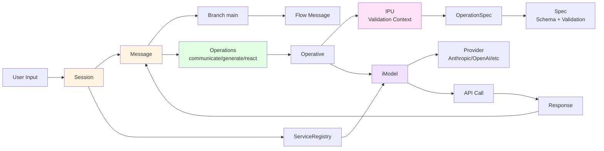

# lionpride Architecture Overview

**Version**: 1.0 (2025-01-24)
**Status**: Alpha
**License**: Apache 2.0
**Author**: HaiyangLi (Ocean)

## Overview

lionpride is the foundational primitives layer for the Lion AGI ecosystem (v1), extracted from 5 years of production learnings from lionagi (v0, Oct 2023 - Jan 2025). It provides composable, protocol-based primitives for building intelligent systems with Wall Street-grade rigor and theoretical physics precision.

**Core Philosophy**: Protocol-based composition (Rust traits, Go interfaces) over inheritance. Three architectural tiers: **Protocols → Primitives → Composition**.

**Key Invariants**:

- **Identity**: Everything is an Element (UUID + metadata)
- **Composition**: Pile for O(1) collections, Flow for workflow state machines
- **Validation**: Two-tier (structural + semantic) via Spec/Operable/Rules
- **Async-first**: Event lifecycle tracking with status management
- **Type-safe**: Discriminated unions, protocol contracts, Pydantic integration

---

## System Architecture

### High-Level Diagram

```mermaid
graph TB
    subgraph "Layer 8: Language (LNDL)"
        LNDL[LNDL v2<br/>Cognitive Programming]
        Lexer[Lexer]
        Parser[Parser]
        AST[AST]
        Resolver[Resolver]
        Cognitive[Cognitive Ops]
    end

    subgraph "Layer 7: Validation & Rules"
        IPU[IPU<br/>Intelligence Processing Unit]
        OpSpec[OperationSpec]
        Rules[Validators<br/>Boolean/Choice/Number/String]
    end

    subgraph "Layer 6: Operations"
        Ops[Operations<br/>communicate/generate/react]
        Operative[Operative]
        Builder[Builder<br/>Operation Graphs]
        FlowExec[Flow Executor<br/>Dependency-aware]
        Streaming[Streaming<br/>Channel/Consumer]
    end

    subgraph "Layer 5: Services"
        iModel[iModel<br/>Unified Service Interface]
        ServiceRegistry[ServiceRegistry<br/>Pile iModel + name index]
        Providers[Providers<br/>Anthropic/OpenAI/Perplexity/Gemini/Groq/Cerebras]
        MCPs[MCPs<br/>MCP Integration]
        Tools[Tool Definitions]
    end

    subgraph "Layer 4: Session"
        Message[Message<br/>Discriminated Content + Auto-derived Role]
        MessageContent[MessageContent<br/>System/Instruction/AssistantResponse/ActionRequest/ActionResponse]
        Branch[Branch<br/>Progression Wrapper]
        Session[Session<br/>Flow Message + ServiceRegistry]
    end

    subgraph "Layer 3: Type System"
        Spec[Spec<br/>Validation + Schema]
        Operable[Operable<br/>Validated Operations]
        Model[Model<br/>Pydantic Base]
        Params[Params<br/>Operation Parameters]
        Sentinels[Sentinels<br/>Undefined/Unset]
    end

    subgraph "Layer 2: Protocols"
        Observable[Observable<br/>UUID identity]
        Serializable[Serializable/Deserializable<br/>to_dict/from_dict]
        Adaptable[Adaptable/AdapterRegisterable<br/>Format conversion]
        AsyncAdaptable[AsyncAdaptable/AsyncAdapterRegisterable<br/>Async format conversion]
        Containable[Containable/Invocable/Hashable/Allowable]
    end

    subgraph "Layer 1: Core Primitives"
        Element[Element<br/>UUID + created_at + metadata]
        Pile[Pile T<br/>O 1 Collections]
        Progression[Progression<br/>Ordered UUIDs]
        Flow[Flow E,P<br/>items + progressions]
        Graph[Graph<br/>Directed + Conditional Edges]
        Node[Node<br/>Polymorphic Content]
        Event[Event<br/>Async Lifecycle]
        EventBus[EventBus/Broadcaster/Processor]
    end

    subgraph "Utilities"
        libs[libs<br/>concurrency/schema_handlers/string_handlers]
        ln[ln<br/>async_call/fuzzy_match/hash/json_dump/to_dict/to_list]
    end

    %% Dependencies (bottom-up)
    Element --> Observable
    Element --> Serializable
    Node --> Element
    Node --> Adaptable
    Message --> Node
    Message --> MessageContent
    Pile --> Element
    Pile --> Containable
    Flow --> Pile
    Flow --> Progression
    Session --> Flow
    Session --> ServiceRegistry
    Session --> Message
    Graph --> Pile
    Graph --> Node
    Event --> Element
    Spec --> Model
    Operable --> Spec
    OpSpec --> Operable
    IPU --> OpSpec
    Ops --> Operative
    Ops --> IPU
    Ops --> Session
    Operative --> iModel
    ServiceRegistry --> Pile
    ServiceRegistry --> iModel
    Builder --> Ops
    FlowExec --> Builder
    LNDL --> Ops
    LNDL --> Cognitive
    Providers --> iModel
    MCPs --> iModel

    %% Utility dependencies
    Element -.-> ln
    Pile -.-> ln
    Ops -.-> libs
    Session -.-> libs

    style Element fill:#e1f5ff
    style Pile fill:#e1f5ff
    style Flow fill:#e1f5ff
    style Graph fill:#e1f5ff
    style Node fill:#e1f5ff
    style Message fill:#fff4e1
    style Session fill:#fff4e1
    style iModel fill:#f0e1ff
    style ServiceRegistry fill:#f0e1ff
    style Ops fill:#e1ffe1
    style IPU fill:#ffe1f5
    style LNDL fill:#ffe1e1
```



### Data Flow Diagram



---

## Layer Architecture

### Layer 1: Core Primitives

**Purpose**: Foundation for identity, collections, workflows, and async execution.

**Components**:

| Component | Purpose | Key Features |
|-----------|---------|--------------|
| **Element** | Base identity for all entities | UUID (frozen), created_at (frozen), metadata (mutable) |
| **Pile[T]** | Type-safe O(1) collections | UUID lookup, index/slice, predicate filters, thread-safe |
| **Progression** | Ordered UUID sequences | List ops, set ops (idempotent), workflow ops (move) |
| **Flow[E,P]** | Workflow state machines | items (Pile[E]), progressions (Pile[P]), referential integrity |
| **Graph** | Directed graphs with conditional edges | Pile-backed nodes/edges, adjacency lists, BFS pathfinding |
| **Node** | Polymorphic content containers | Adaptable (TOML/YAML/JSON), embedding support |
| **Event** | Async lifecycle tracking | Status (PENDING→PROCESSING→COMPLETED/FAILED), timeout, retry |
| **EventBus** | Event pub/sub system | Handler registration, event broadcasting |
| **Broadcaster** | Message broadcasting | Multi-consumer event dispatch |
| **Processor** | Event processing pipeline | Executor pattern for event handling |

**Key Patterns**:

- **Identity**: All primitives inherit from Element (UUID-based)
- **Composition**: Pile powers Flow, Graph, ServiceRegistry (O(1) lookups everywhere)
- **Immutability**: UUID and created_at are frozen (identity stability)
- **Async-first**: Event-driven with status tracking

**Source**: `lionpride/src/lionpride/core/`

---

### Layer 2: Protocols

**Purpose**: Composition contracts (Rust-like traits) for capabilities.

**Protocol Groups**:

| Protocol | Purpose | Required Members | Runtime Checkable |
|----------|---------|------------------|-------------------|
| **Observable** | UUID identity | `id: UUID` | ✓ |
| **Serializable** | Dict serialization | `to_dict(**kwargs) -> dict` | ✓ |
| **Deserializable** | Dict deserialization | `from_dict(data, **kwargs) -> Any` | ✓ |
| **Adaptable** | Sync format conversion | `adapt_to(key, **kwargs)`, `adapt_from(obj, key)` | ✓ |
| **AdapterRegisterable** | Mutable adapter registry | `register_adapter(adapter)` | ✓ |
| **AsyncAdaptable** | Async format conversion | `adapt_to_async(key)`, `adapt_from_async(obj)` | ✓ |
| **AsyncAdapterRegisterable** | Async adapter registry | `register_async_adapter(adapter)` | ✓ |
| **Containable** | Membership testing | `__contains__(item) -> bool` | ✓ |
| **Invocable** | Async execution | `invoke() -> Any` | ✓ |
| **Hashable** | Hash for sets/dicts | `__hash__() -> int` | ✓ |
| **Allowable** | Allowed values/keys | `allowed() -> set[str]` | ✓ |

**Key Pattern**: `@implements(*protocols)` decorator enforces protocol implementation in class body (not inherited), stores on `cls.__protocols__`.

**Why Protocols?**:

- **Composition over inheritance**: Mix capabilities without deep hierarchies
- **Explicit contracts**: Rust-like trait system (MUST define in class body)
- **Runtime validation**: `isinstance(obj, Protocol)` for capability checks
- **Type safety**: Mypy/Pyright enforce protocol conformance

**Source**: `lionpride/src/lionpride/protocols.py`

---

### Layer 3: Type System

**Purpose**: Validation, schema generation, and operation parameterization.

**Components**:

| Component | Purpose | Key Features |
|-----------|---------|--------------|
| **Spec** | Validation + schema | Two-tier validation (structural + semantic), JSON schema generation |
| **Operable** | Validated operations | Integrates Spec for pre/post-validation, execution tracking |
| **Model** | Pydantic base | HashableModel (UUID-based hash), strict field_validator rules |
| **Params** | Operation parameters | CommunicateParam, GenerateParam, ReactParam, OperateParam |
| **Sentinels** | Undefined/Unset types | MaybeUndefined, MaybeUnset, MaybeSentinel for three-valued logic |

**Two-Tier Validation**:

1. **Structural** (Spec): Field types, required fields, constraints
2. **Semantic** (Rules): Business logic, cross-field validation, conditional rules

**Key Patterns**:

- **Spec + Rules**: Structural validation in Spec, semantic validation in Rules
- **Operable**: Wraps operations with pre/post Spec validation
- **Sentinels**: Distinguish "not provided" (Undefined) vs "explicitly cleared" (Unset)

**Source**: `lionpride/src/lionpride/types/`

---

### Layer 4: Session Layer

**Purpose**: Conversation management with message lifecycle and role derivation.

**Components**:

| Component | Purpose | Key Features |
|-----------|---------|--------------|
| **Message** | Universal container | Discriminated union content, auto-derived role, lineage tracking |
| **MessageContent** | Content types | System, Instruction, AssistantResponse, ActionRequest, ActionResponse |
| **Branch** | Progression wrapper | Named conversation branch (e.g., "main", "exploration") |
| **Session** | Conversation state | Flow[Message] (messages), ServiceRegistry (models), Branch management |

**Message Content → Role Mapping**:

```python
SystemContent           → MessageRole.SYSTEM
InstructionContent      → MessageRole.USER
AssistantResponseContent → MessageRole.ASSISTANT
ActionRequestContent    → MessageRole.ASSISTANT
ActionResponseContent   → MessageRole.TOOL
```

**Key Patterns**:

- **Discriminated Union**: MessageContent uses Pydantic discriminator for type-safe content
- **Auto-derived Role**: Role computed from content type (no manual role management)
- **Flow-based State**: Session = Flow[Message] + ServiceRegistry (messages decoupled from models)
- **Branch = Progression**: Enables multi-branch conversations (main, exploration, debug)

**Why This Design?**:

- **O(1) Message Lookup**: Flow[Message] uses Pile for UUID-based retrieval
- **Referential Integrity**: Progressions (branches) reference existing messages
- **Lineage Tracking**: `msg.clone()` preserves ancestry
- **Service Isolation**: ServiceRegistry separate from message state

**Source**: `lionpride/src/lionpride/session/`

---

### Layer 5: Services Layer

**Purpose**: Unified service boundary for models, tools, and MCPs.

**Components**:

| Component | Purpose | Key Features |
|-----------|---------|--------------|
| **iModel** | Unified service interface | Endpoint, Tool, Calling (invoke/stream/batch) |
| **ServiceRegistry** | Service management | Pile[iModel] + name index, MCP integration, tag-based lookup |
| **Providers** | Model implementations | Anthropic, OpenAI, Perplexity, Gemini, Groq, Cerebras |
| **MCPs** | MCP server integration | Async MCP server registration, tool extraction |
| **Tools** | Tool definitions | Schema-based tool specifications |
| **Execution** | Service execution | Async execution context, rate limiting, retries |

**Key Patterns**:

- **Pile[iModel]**: ServiceRegistry is Pile[iModel] with name index for O(1) lookup
- **Uniform Interface**: All services (models, MCPs, tools) implement iModel
- **Provider Pattern**: Concrete implementations for each LLM provider
- **MCP Integration**: `await registry.register_mcp_server(config, tool_names)`

**ServiceRegistry Operations**:

```python
registry.register(model, update=False)      # Add service
registry.get(name)                          # O(1) name lookup
registry.list_by_tag(tag)                   # Filter by tag
await registry.register_mcp_server(config)  # Add MCP server
```

**Source**: `lionpride/src/lionpride/services/`

---

### Layer 6: Operations Layer

**Purpose**: High-level cognitive operations (communicate, generate, react) with execution orchestration.

**Components**:

| Component | Purpose | Key Features |
|-----------|---------|--------------|
| **Operations** | Core ops | communicate (chat), generate (structured output), react (ReAct pattern) |
| **Operative** | Execution context | iModel wrapper, IPU integration, message formatting |
| **Builder** | Operation graphs | Compose operations into DAGs, dependency resolution |
| **Flow Executor** | Dependency-aware execution | Topological sort, parallel execution, error handling |
| **Streaming** | Real-time output | Channel (async queue), Consumer (stream handler), Output (result aggregation) |

**Core Operations**:

| Operation | Purpose | Input | Output |
|-----------|---------|-------|--------|
| **communicate** | Chat conversation | Session, Branch, instruction, iModel | Message (AssistantResponse) |
| **generate** | Structured output | Session, Branch, instruction, response_model, iModel | Message (Pydantic model) |
| **react** | ReAct pattern | Session, Branch, instruction, tools, iModel | ReactResult (thoughts + actions) |
| **operate** | Generic operation | Session, Branch, Operative | Message |

**Key Patterns**:

- **Operative Pattern**: Wraps iModel with Session/Branch context, message preparation
- **IPU Integration**: Operative uses IPU for validated execution context
- **Builder → Flow**: Compose operations into graphs, execute with dependencies
- **Streaming**: Channel-based async streaming for real-time output

**Why This Layer?**:

- **Abstraction**: `communicate/generate/react` hide Session/Message complexity
- **Composability**: Builder enables operation graphs (A → B → C)
- **Validation**: IPU ensures operation contracts are satisfied
- **Streaming**: Real-time output without blocking

**Source**: `lionpride/src/lionpride/operations/`

---

### Layer 7: Validation & Rules

**Purpose**: Two-tier validation (structural + semantic) with IPU execution context.

**Components**:

| Component | Purpose | Key Features |
|-----------|---------|--------------|
| **IPU** | Intelligence Processing Unit | Validated execution context (validation → structure → usefulness) |
| **OperationSpec** | Operation specifications | Integrates Operable for operation contracts |
| **Rules** | Validators | Boolean, Choice, Number, String validators with error details |
| **Validator** | Rule engine | Two-tier validation: Spec (structural) + Rules (semantic) |

**IPU Pattern** (from lionagi v0.2.2):

```
validation → structure → usefulness
```

**Two-Tier Validation**:

1. **Structural (Spec)**: Field types, required fields, constraints (Pydantic)
2. **Semantic (Rules)**: Business logic, cross-field validation, conditional rules

**Rule Types**:

| Rule | Purpose | Example |
|------|---------|---------|
| **BooleanRule** | Boolean validation | Must be True, Must be False |
| **ChoiceRule** | Allowed values | Must be in ["A", "B", "C"] |
| **NumberRule** | Numeric constraints | Must be > 0, Must be in [0, 100] |
| **StringRule** | String patterns | Must match regex, Must have length > 5 |

**Key Patterns**:

- **IPU Context**: Operations execute within IPU for validated context
- **OperationSpec**: Combines Operable + Spec for operation contracts
- **Rule Composition**: Rules chain for complex validation (AND/OR logic)
- **Error Details**: Validators provide structured error messages

**Source**: `lionpride/src/lionpride/ipu/`, `lionpride/src/lionpride/rules/`

---

### Layer 8: Language Layer (LNDL)

**Purpose**: LNDL v2 cognitive programming language for declarative operation specification.

**Components**:

| Component | Purpose | Key Features |
|-----------|---------|--------------|
| **Lexer** | Tokenization | LNDL syntax → tokens |
| **Parser** | AST construction | Tokens → abstract syntax tree |
| **AST** | Abstract syntax tree | Operation nodes, assignment nodes, block nodes |
| **Cognitive Ops** | Cognitive operations | remember, recall, reason, reflect, learn |
| **Resolver** | Symbol resolution | Variable/function resolution, scope management |
| **Fuzzy Matching** | Error recovery | Fuzzy symbol matching for error correction |

**LNDL Example**:

```lndl
# Cognitive operation with structured output
result = remember(
    content="User prefers dark mode",
    context="preferences"
)

# ReAct pattern
answer = react(
    instruction="What's the weather?",
    tools=[weather_tool],
    max_steps=3
)
```

**Key Patterns**:

- **Declarative**: Operations specified as data, not imperative code
- **Cognitive Primitives**: remember, recall, reason, reflect, learn
- **AST-based**: Parser builds AST for validation and optimization
- **Fuzzy Resolution**: Handles typos and partial matches gracefully

**Source**: `lionpride/src/lionpride/lndl/`

---

## Utility Layers

### libs (Domain-Specific Utilities)

**Purpose**: Domain-specific utilities for concurrency, schemas, and string handling.

| Module | Purpose | Key Functions |
|--------|---------|---------------|
| **concurrency** | Async utilities | Concurrent execution, rate limiting, backoff |
| **schema_handlers** | Schema operations | JSON schema generation, validation, merging |
| **string_handlers** | String operations | Template rendering, escaping, normalization |

**Source**: `lionpride/src/lionpride/libs/`

### ln (Core Language Utilities)

**Purpose**: Core language utilities for async calls, fuzzy matching, hashing, serialization.

| Module | Purpose | Key Functions |
|--------|---------|---------------|
| **async_call** | Async function calls | `alcall()`, retry logic, timeout handling |
| **fuzzy_match** | Fuzzy string matching | Levenshtein distance, similarity scoring |
| **fuzzy_validate** | Fuzzy validation | Validate with error correction |
| **hash** | Hashing | UUID-based hashing, content hashing |
| **json_dump** | JSON serialization | Custom serializers for UUID, datetime, BaseModel |
| **list_call** | List operations | `lcall()` for list comprehensions |
| **to_dict** | Dict conversion | Universal to_dict with mode/format support |
| **to_list** | List conversion | Universal to_list with flattening |
| **utils** | General utilities | Type checks, sentinel handling |

**Source**: `lionpride/src/lionpride/ln/`

---

## Key Architectural Patterns

### 1. Protocol-Based Composition

**Problem**: Deep inheritance hierarchies are brittle and hard to evolve.

**Solution**: Protocols (Rust-like traits) for capability composition.

```python
from lionpride import implements
from lionpride.protocols import Observable, Serializable

@implements(Observable, Serializable)
class MyEntity(Element):
    def to_dict(self, **kwargs) -> dict:
        return {"id": str(self.id), "data": self.data}
```

**Benefits**:

- **Explicit contracts**: Clear capabilities without inheritance
- **Runtime validation**: `isinstance(obj, Protocol)` checks
- **Type safety**: Mypy/Pyright enforce protocol conformance

---

### 2. Two-Tier Validation

**Problem**: Single-tier validation conflates structural (types) and semantic (business logic) concerns.

**Solution**: Separate Spec (structural) and Rules (semantic).

```python
from lionpride.types import Spec
from lionpride.rules import NumberRule, Validator

class AgeSpec(Spec):
    age: int  # Structural: must be int

age_validator = Validator(
    rules=[NumberRule(min_value=0, max_value=120)]  # Semantic: must be 0-120
)
```

**Benefits**:

- **Separation of concerns**: Types vs business logic
- **Reusable rules**: Share semantic validation across specs
- **Clear errors**: Structural vs semantic failure modes

---

### 3. Flow-Based State Management

**Problem**: Linear list-based conversation state makes branching/forking hard.

**Solution**: Flow[Message] = Pile[Message] + Pile[Progression].

```python
session = Session()
session.add_message(msg1, branch="main")
session.add_message(msg2, branch="main")
session.add_message(msg3, branch="exploration")  # Fork

main_msgs = session.get_messages(branch="main")       # [msg1, msg2]
explore_msgs = session.get_messages(branch="exploration")  # [msg3]
```

**Benefits**:

- **O(1) lookup**: UUID-based message retrieval
- **Multi-branch**: Parallel conversation threads
- **Referential integrity**: Progressions reference existing messages

---

### 4. Event Lifecycle Tracking

**Problem**: Async operations lack observability (status, errors, timing).

**Solution**: Event with status state machine.

```python
class MyOperation(Event):
    async def _invoke(self):
        # Operation logic
        return result

event = MyOperation(timeout=5.0)
result = await event.invoke()

print(event.status)  # EventStatus.COMPLETED
print(event.execution.duration)  # Execution time
```

**State Machine**:

```
PENDING → PROCESSING → COMPLETED
                    ↘ FAILED
```

**Benefits**:

- **Observability**: Track execution status, duration, errors
- **Timeout handling**: Automatic timeout enforcement
- **Retry support**: `event.as_fresh_event()` for retries

---

### 5. Operative Pattern (Service Abstraction)

**Problem**: Direct iModel usage requires Session/Branch management in every operation.

**Solution**: Operative wraps iModel with context.

```python
operative = create_operative_from_model(
    model=session.registry.get("gpt-4"),
    session=session,
    branch="main"
)

# Operative handles message preparation, context injection
result = await operative.communicate(instruction="Hello")
```

**Benefits**:

- **Context injection**: Session/Branch automatically injected
- **Message formatting**: Auto-converts to chat API format
- **IPU integration**: Validated execution context
- **Reusable**: Same operative for multiple operations

---

### 6. Discriminated Union Content (Message)

**Problem**: Manual role management is error-prone.

**Solution**: Auto-derive role from content type (discriminated union).

```python
# Content type determines role
msg1 = Message(content={"instruction": "Do X"})  # → MessageRole.USER
msg2 = Message(content={"response": "Done"})     # → MessageRole.ASSISTANT
msg3 = Message(content={"name": "tool", "output": "Y"})  # → MessageRole.TOOL
```

**Benefits**:

- **Type safety**: Pydantic validates content structure
- **No manual role**: Role derived from content type
- **Clear contracts**: Each content type has explicit schema

---

## Extension Points

### 1. Adding Custom Providers

**Location**: `lionpride/src/lionpride/services/providers/`

**Steps**:

1. Implement `iModel` protocol
2. Define `Endpoint` configuration
3. Implement `invoke()`, `stream()`, `batch()` methods
4. Register in `ServiceRegistry`

**Example**:

```python
from lionpride.services import iModel, Endpoint

class CustomProvider(iModel):
    endpoint: Endpoint

    async def invoke(self, messages, **kwargs):
        # Implementation
        pass

    async def stream(self, messages, **kwargs):
        async for chunk in ...:
            yield chunk

# Register
registry = ServiceRegistry()
registry.register(CustomProvider(endpoint=...))
```

---

### 2. Adding Custom Operations

**Location**: `lionpride/src/lionpride/operations/operate/`

**Steps**:

1. Define operation function with `OperateParam`
2. Use `Operative` for model execution
3. Return `Message` with appropriate content type
4. Register in `OperationRegistry`

**Example**:

```python
from lionpride.operations import OperateParam, operate

async def custom_op(param: OperateParam) -> Message:
    operative = create_operative_from_model(
        model=param.model,
        session=param.session,
        branch=param.branch
    )
    result = await operative.communicate(instruction=param.instruction)
    return result

# Use
result = await custom_op(OperateParam(session=session, ...))
```

---

### 3. Adding Custom Rules

**Location**: `lionpride/src/lionpride/rules/`

**Steps**:

1. Inherit from `BaseRule`
2. Implement `validate()` method
3. Return `RuleResult` with success/error details
4. Compose with other rules via `Validator`

**Example**:

```python
from lionpride.rules import BaseRule, RuleResult

class EmailRule(BaseRule):
    def validate(self, value: Any) -> RuleResult:
        if "@" not in value:
            return RuleResult(success=False, error="Must be email")
        return RuleResult(success=True)

# Use
validator = Validator(rules=[EmailRule()])
result = validator.validate("user@example.com")
```

---

### 4. Adding Custom Node Adapters

**Location**: Custom class inheriting `Node`

**Steps**:

1. Define custom `Node` subclass
2. Create adapter class with `adapt_to()`/`adapt_from()`
3. Register via `CustomNode.register_adapter(adapter)`
4. Use `node.adapt_to(key)` for conversion

**Example**:

```python
from lionpride import Node

class CustomAdapter:
    @staticmethod
    def adapt_to(node: Node, **kwargs) -> str:
        return f"Custom: {node.content}"

    @staticmethod
    def adapt_from(data: str) -> Node:
        return Node(content={"data": data})

class CustomNode(Node):
    pass

CustomNode.register_adapter(CustomAdapter)

# Use
node = CustomNode(content={"x": 1})
output = node.adapt_to("custom")
```

---

### 5. Adding Custom Message Content Types

**Location**: `lionpride/src/lionpride/session/messages/`

**Steps**:

1. Define Pydantic model with discriminator
2. Add to `MessageContent` union
3. Define role mapping in `Message._derive_role()`
4. Update `prepare_messages_for_chat()` if needed

**Example**:

```python
from pydantic import BaseModel, Field
from lionpride.session import MessageContent, MessageRole

class CustomContent(BaseModel):
    custom_type: Literal["custom"] = Field(default="custom", discriminator=True)
    data: str

# Add to MessageContent union (in messages/__init__.py)
MessageContent = Union[SystemContent, InstructionContent, ..., CustomContent]

# Update Message._derive_role()
@staticmethod
def _derive_role(content: MessageContent) -> MessageRole:
    if isinstance(content, CustomContent):
        return MessageRole.USER  # or appropriate role
    # ... existing mappings
```

---

### 6. Adding Custom LNDL Operations

**Location**: `lionpride/src/lionpride/lndl/operations.py`

**Steps**:

1. Define async function with LNDL signature
2. Add to operation registry
3. Update parser for syntax support (if needed)
4. Document in LNDL reference

**Example**:

```python
async def custom_cognitive_op(
    context: dict,
    instruction: str,
    **kwargs
) -> Any:
    # Implementation
    return result

# Register
LNDL_OPS = {
    "custom_op": custom_cognitive_op,
    # ... existing ops
}
```

---

## Design Decisions

### Why Pile[T] Over list[T]?

**Rationale**: O(1) UUID lookup + type safety + thread safety.

| Feature | list[T] | Pile[T] |
|---------|---------|---------|
| UUID lookup | O(n) | O(1) |
| Type checking | No | Yes (strict_type) |
| Thread safety | No | Yes (locks) |
| Index access | O(1) | O(1) |
| Predicate filter | Manual | Built-in |

**Trade-off**: Slightly higher memory (dict + list) for faster lookups.

---

### Why Flow[E,P] Over list[E]?

**Rationale**: Multi-branch conversations require graph structure.

**Limitations of list[E]**:

- Linear only (no branches)
- No named sequences
- Expensive to fork (copy entire list)

**Benefits of Flow[E,P]**:

- Multi-branch: Parallel conversation threads
- O(1) lookup: Pile[E] for messages
- Named progressions: "main", "exploration", "debug"
- Cheap forking: Share items, copy progression

---

### Why Auto-Derived Roles (Message)?

**Rationale**: Eliminate manual role management errors.

**Problem with manual roles**:

```python
# Error-prone: role mismatch
msg = Message(role=MessageRole.ASSISTANT, content={"instruction": "X"})
```

**Solution (auto-derived)**:

```python
# Role derived from content type
msg = Message(content={"instruction": "X"})  # → MessageRole.USER (automatic)
```

**Trade-off**: Less flexibility, but eliminates entire class of bugs.

---

### Why ServiceRegistry Over dict[str, iModel]?

**Rationale**: Tag-based lookup, MCP integration, Pile benefits.

| Feature | dict[str, iModel] | ServiceRegistry |
|---------|-------------------|-----------------|
| Name lookup | O(1) | O(1) |
| UUID lookup | No | O(1) (via Pile) |
| Tag filtering | Manual | Built-in |
| MCP integration | Manual | Built-in |
| Thread safety | No | Yes (Pile) |

---

### Why Two-Tier Validation (Spec + Rules)?

**Rationale**: Separation of concerns (structural vs semantic).

**Single-tier problems**:

- Conflates types and business logic
- Hard to reuse validation across specs
- Unclear error sources

**Two-tier benefits**:

- **Spec**: Structural validation (Pydantic)
- **Rules**: Semantic validation (business logic)
- Reusable rules across multiple specs
- Clear error categorization

---

### Why Protocol-Based Over Inheritance?

**Rationale**: Composition over inheritance (Rust traits, Go interfaces).

**Inheritance problems**:

- Deep hierarchies are brittle
- Diamond problem
- Hard to evolve

**Protocol benefits**:

- Mix capabilities without inheritance
- Explicit contracts (Rust-like)
- Runtime validation (`isinstance(obj, Protocol)`)
- Type safety (Mypy/Pyright)

---

## Migration from lionagi v0

lionpride extracts foundational patterns from 5 years of lionagi (v0, Oct 2023 - Jan 2025) production use.

**Key Changes**:

| lionagi v0 | lionpride v1 | Rationale |
|------------|--------------|-----------|
| `flow.pile` | `flow.items` + `flow.progressions` | Explicit composition (items + order) |
| `graph.get_node(uuid)` | `graph.nodes[uuid]` | Direct Pile access (O(1)) |
| String exceptions | Typed exceptions (NotFoundError, ExistsError) | Type safety, better error handling |
| Manual role management | Auto-derived roles (Message) | Eliminate manual errors |
| Single-tier validation | Two-tier (Spec + Rules) | Separation of concerns |

**Migration Path**:

1. Read lionpride source for "what" (implementation)
2. Read lionagi v0 for "why" (rationale from production)
3. Understand patterns evolved over 5 years
4. Apply to new lionpride code

---

## Testing & Quality

**Coverage**: ≥99% (pytest-cov)

**Linting**:

```bash
uv run ruff format .
uv run ruff check .
uv run mypy src/
```

**Testing**:

```bash
uv run pytest --cov=lionpride --cov-report=term-missing
```

**Standards**:

- **Type safety**: Full Mypy strict mode
- **Protocol conformance**: Runtime `isinstance()` checks
- **Serialization**: All primitives support `to_dict()`/`from_dict()`
- **Thread safety**: Pile, ServiceRegistry are thread-safe

---

## Performance Characteristics

| Operation | Complexity | Notes |
|-----------|-----------|-------|
| Pile UUID lookup | O(1) | Dict-backed |
| Pile index access | O(1) | List-backed |
| Pile predicate filter | O(n) | Full scan |
| Flow add_item | O(1) | Pile add + progression updates |
| Graph add_node | O(1) | Pile add |
| Graph add_edge | O(1) | Pile add + adjacency update |
| Graph BFS | O(V + E) | Standard graph traversal |
| ServiceRegistry name lookup | O(1) | Name index |
| Session get_messages | O(m) | m = messages in branch |

**Optimization Targets**:

- **Pile**: O(1) lookups (99% of operations)
- **Graph**: Sparse adjacency lists (memory-efficient)
- **Session**: Branch-based message filtering (avoid full scan)

---

## See Also

**Code References**:

- `CLAUDE.md` - High-level API reference
- `AGENTS.md` - Quick reference for AI agents
- `lionpride/notebooks/` - Executable examples
- `lionagi/README.md` - Production use cases

**Related Documentation**:

- `docs/api/` - API reference
- `docs/tutorials/` - Step-by-step guides
- `docs/patterns/` - Design patterns
- `docs/user_guide/` - User documentation

**External Resources**:

- lionagi repository: <https://github.com/khive-ai/lionagi>
- lionpride repository: <https://github.com/khive-ai/lionpride>

---

**Copyright**: © 2025 HaiyangLi (Ocean) - Apache 2.0 License
